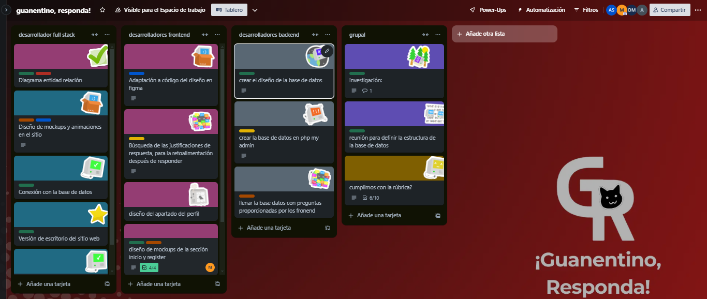

# Guanentino, ¡Responda!

## Descripción.

Con el fin de contribuir en el mejoramiento de la calidad educativa de nuestro Colegio San José de Guanentá, y de manera particular de los resultados obtenidos en el examen de estado SABER 11 por parte de los estudiantes, se pretende diseñar y construir una plataforma web por medio de la cual de manera diaria y aleatoria, el estudiante pueda responder una pregunta, recibiendo la respectiva retroalimentación y explicación a su respuesta, el puntaje obtenido y el acumulado hasta la fecha.  El banco de preguntas a utilizar será tomado directamente del material liberado por el ICFES y por el programa Evaluar para Avanzar del Ministerio de Educación Nacional, incluyendo las 5 áreas evaluadas: Matemáticas, Ciencias Sociales, Lectura Crítica, Ciencias Naturales e Inglés.  La plataforma tendrá un diseño y una interfaz de usuario práctica y de fácil manejo.

---

## Recursos del proyecto.

Por parte de la institución contamos con un espacio de trabajo, en el cual podemos reunirnos semanalmente para el desarrollo de este proyecto.  Nuestros profesores nos orientan con los lenguajes o temas de programación, dándonos introducciones a los lenguajes y explicándonos las bases de estos mismos, para que podamos continuar con la profundización por nuestra propia cuenta.  Contamos con computadores portátiles y conectividad a internet, para el desarrollo de este proyecto.  Tenemos conocimientos básicos en los lenguajes HTML, CSS, Javascript, PHP y bases de datos.

### Área del proyecto:
Inclusión, Sostenibilidad y Bienestar

### Institución Educativa:

Colegio San José de Guanentá, San Gil, Santander

### Media Técnica:
Especialidad en Sistemas

---

# Metodología de trabajo

para nuestra metodología de trabajo optamos hacer uso del método scrum, pero ¿Qué es la metodología scrum?

## ¿En qué consiste la metodología de Scrum?

La **metodología Scrum** es un marco ágil diseñado para facilitar el trabajo colaborativo en la gestión de proyectos, especialmente en entornos complejos y con requisitos cambiantes. Su principal objetivo es maximizar el rendimiento del equipo y lograr resultados de alta calidad a través de entregas regulares y parciales.

### Aplicaciones de Scrum
Scrum es ideal para proyectos donde se requieren resultados a corto plazo y donde hay incertidumbre o tareas poco definidas. También es útil para identificar y resolver ineficiencias, mejorar la productividad y adaptarse a la competencia. Además, permite abordar problemas de entrega y calidad, así como mantener la moral del equipo en situaciones de alta rotación.

### Fases de la Metodología Scrum

1. **Planificación**: Product Backlog

    Se establece una lista priorizada de tareas, conocida como Product Backlog. El Product Owner, junto con el equipo, identifica y prioriza los elementos esenciales, fomentando una comunicación continua con los stakeholders para reflejar sus necesidades.

2. **Ejecución**: Sprint

    Un Sprint es un período de trabajo, normalmente de hasta un mes, donde se desarrollan tareas del Product Backlog. Cada Sprint incluye una planificación (Sprint Planning), una revisión del trabajo completado (Sprint Review) y una retrospectiva para reflexionar sobre el proceso y mejorar (Sprint Retrospective).

3. **Control y Monitorización:** Daily Scrum y Burn Down Chart

    El Daily Scrum es una breve reunión diaria para que el equipo sincronice actividades y aborde obstáculos. El Burn Down Chart permite visualizar el progreso y el trabajo pendiente, facilitando ajustes rápidos en la planificación.

4. **Revisión y Adaptación:** Sprint Review y Retrospective

    Al final de cada Sprint, se evalúa el trabajo realizado en la Sprint Review, ajustando el Product Backlog según sea necesario. En la Retrospective, el equipo reflexiona sobre su desempeño y busca oportunidades de mejora, fomentando un entorno de aprendizaje continuo.
---
## Distribución de trabajo:

Dispusimos de Trello, una herramienta que nos ayuda a distribuir nuestro trabajo de una manera efectiva y práctica, con este recurso podemos distribuir las tareas según el rol asignado a cada miembro,también identificando el estado de cada tarea tal y como podemos ver a continuación:

# Documentación del proyecto

