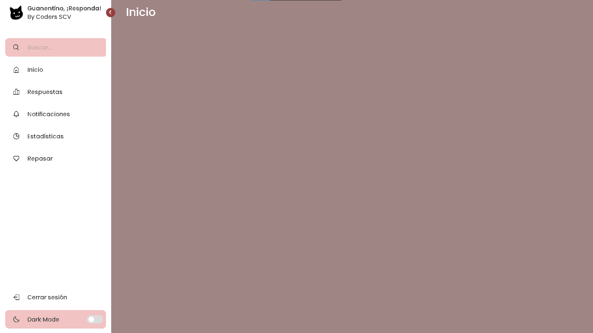
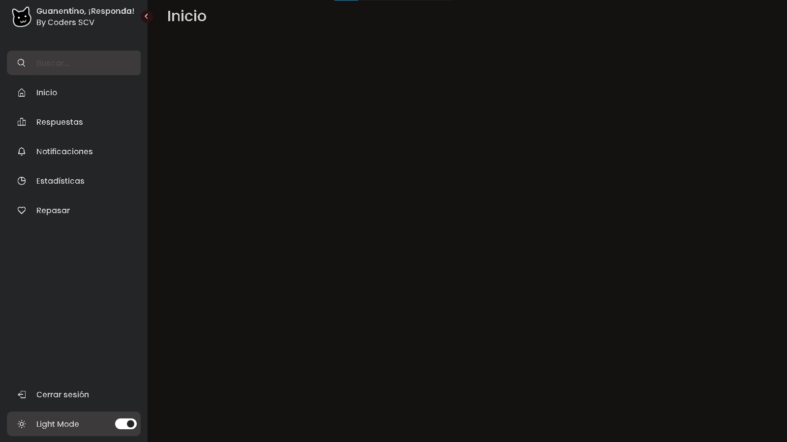
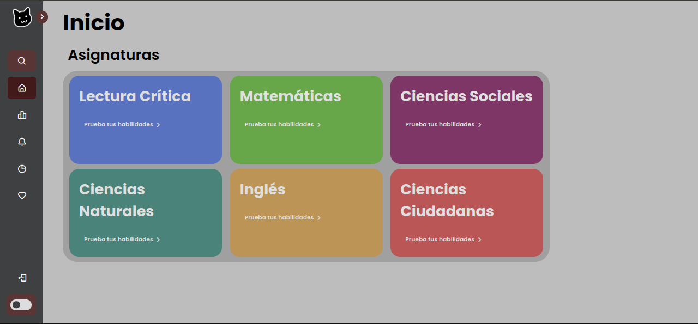
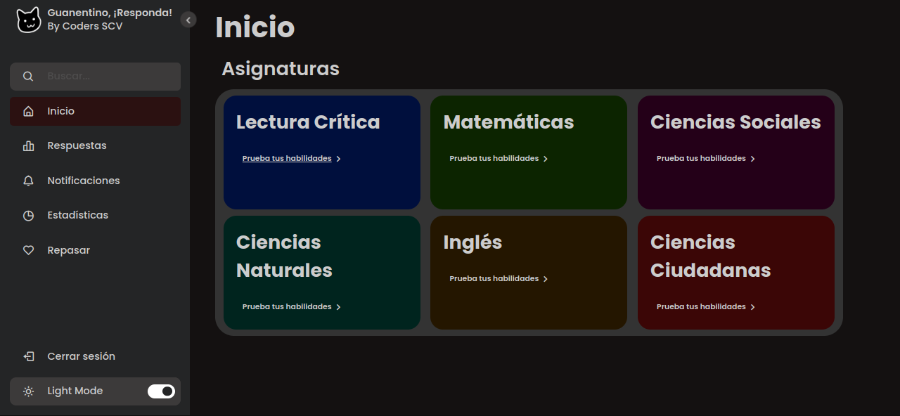

# Guanentino, ¡Responda!

# Capturas de pantalla

## Version 1

### Modo claro
 

### Modo oscuro
 

## Versión actual (sujeta a cambios)

En la sección home se añadió la cuadrícula con las distintas asignaturas para responder las preguntas.

### Modo claro
 

### Modo oscuro
 

 (Se tiene pensado agregar otra barra lateral en el lado derecho para añadir estadísticas de las respuestas).